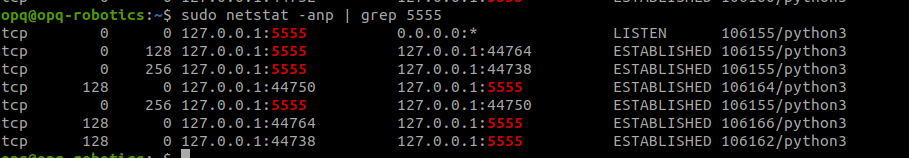

# Python Socket Benchmarking

This repo is a simple but effective testbed for demonstrating **why blocking sockets break under load** — and why **asyncio is the better choice** for scalable, stable socket communication in Python.

We simulate a TCP server sending high-frequency messages to clients using two approaches:

- `blocking.py` — a client using the standard `socket` library with a blocking `.recv()` loop
- `async.py` — a client using `asyncio` with non-blocking reads and a decoupled processing loop

---

## How It Works

- `server.py` continuously sends 128-byte messages to any connected client (roughly 100,000 msgs/sec).
- Each client prints progress as it receives or processes messages.
- We simulate artificial processing delays (e.g. `sleep(0.0005)`) to mimic real-world workloads.

You can run multiple clients to test how each approach handles load.

---

## The Test

Run this in one terminal:

    python3 server.py

In 3 other terminals, run:

    python3 blocking.py

In 3 other terminals, run:

    python3 async.py
    
Then monitor TCP buffer usage:

    netstat -anp | grep 5555
    
## What You'll See

- Blocking clients cause the server's Send-Q to grow into the kilobytes.

- Async clients keep the Send-Q nearly zero at all times.

- Even with the same artificial delays, `asyncio` continues to read from the socket, while the blocking client does not.
- The server stays stable with async clients, but begins choking with blocking clients.
- This benchmark runs under moderate local load. In real-world systems with network latency, higher message rates or heavier processing, **blocking sockets can cause Send-Q to grow into the megabytes,** leading to severe backpressure, stalled connections or even server crashes if not properly mitigated.

## Conclusion

This is a super simple way to show a very real problem in production socket systems. 

If your client can't keep up, you're not just hurting yourself - you might be stalling the server too.

Async is the way to go for high-throughput data streams, real-time responsiveness, avoiding TCP backpressure, and clean separation of I/O and processing.